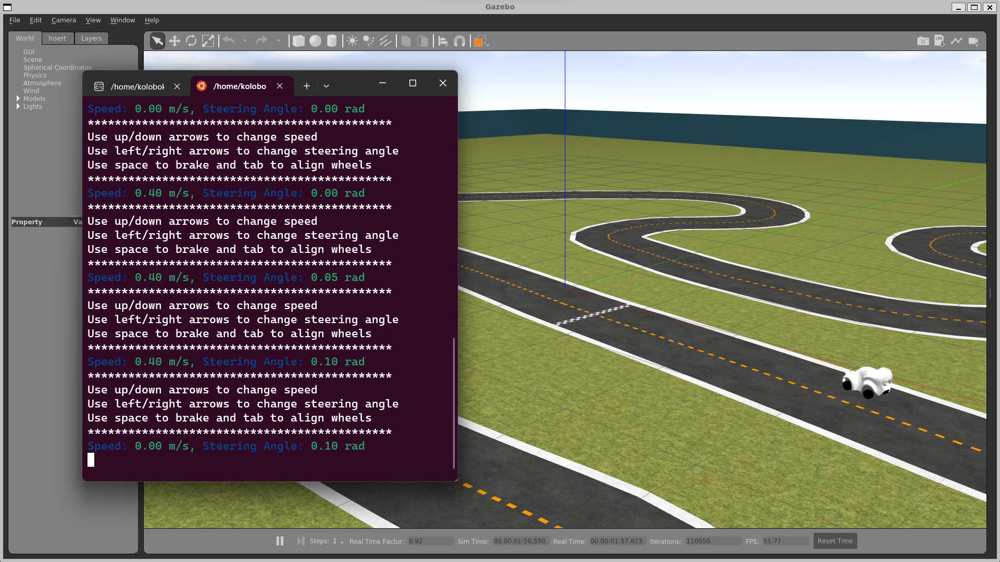

# deepRacerSim - Simulation for an AWS deepRacer car

## Installation

### With Docker

You might need to run ```xhost +local:root``` on the host machine to allow the Docker container to access the X11 server.

```
# change dir to this repository
cd deepRacerSim

# Build docker image with
docker build -f deepRacerSim.Dockerfile -t deep-simulator .
```

### With Ubuntu 20.04 or Windows

0. Windows users
   - You will need to be on Windows 11 Build 22000 or later.
   - Install driver for vGPU to run Linux GUI apps
      * [Intel GPU driver for WSL](https://www.intel.com/content/www/us/en/download/19344/intel-graphics-windows-10-windows-11-dch-drivers.html)
      * [AMD GPU driver for WSL](https://www.amd.com/en/support/kb/release-notes/rn-rad-win-wsl-support)
      * [NVIDIA GPU driver for WSL](https://developer.nvidia.com/cuda/wsl)
   - Install WSL2. Open `Microsoft Store` and install Ubuntu 20.04.
   - Run Ubuntu 20.04
1. Install [ROS1 Noetic](http://wiki.ros.org/noetic/Installation)
2. Get this repository

```
# Install Git and Python3 if not installed
apt-get update && apt-get install -y git python3-pip

# Download this repository
git clone https://github.com/CatUnderTheLeaf/deepRacerSim.git

# Change working directory, replace with appropriate path
cd /path/to/deepRacerSim/deep_ws

# Source ROS1 if it is not in ~/.bashrc
# or just add it to ~/.bashrc with
# echo "source /opt/ros/noetic/setup.bash" >> ~/.bashrc
source /opt/ros/noetic/setup.bash

# Install package dependencies
rosdep fix-permissions
rosdep update
rosdep install --from-paths src --ignore-src --rosdistro noetic

# Build packages
catkin_make -DPYTHON_EXECUTABLE=/usr/bin/python3

# export path variables for Gazebo, replace with appropriate path
export GAZEBO_MODEL_PATH=$GAZEBO_MODEL_PATH:/path/to/deepRacerSim/deep_ws/src/simulation/tracks/
export GAZEBO_RESOURCE_PATH=$GAZEBO_RESOURCE_PATH:/path/to/deepRacerSim/deep_ws/src/simulation/

# also add it to ~/.bashrc not to export it all the time
echo "export GAZEBO_MODEL_PATH=$GAZEBO_MODEL_PATH:/path/to/deepRacerSim/deep_ws/src/simulation/tracks/" >> ~/.bashrc
echo "export GAZEBO_RESOURCE_PATH=$GAZEBO_RESOURCE_PATH:/path/to/deepRacerSim/deep_ws/src/simulation/" >> ~/.bashrc
```

## Simulation

### Launch simulation
   ```
   cd /path/to/deepRacerSim/deep_ws

   # ---- if with Docker ----

   # launch a Docker container
   ./launch_docker.sh 

   # ---- else ----

   source devel/setup.bash

   # export GAZEBO_MODEL_PATH and GAZEBO_RESOURCE_PATH from installation if they are not in ~/.bashrc

   # ---- endif ----

   # launch simulation
   # there will be 1-2 gazebo model errors - it is ok,
   # Gazebo just doesn't like .git files and stacked folders
   roslaunch simulation simulation.launch
   ```
### Control the car
   ```
   # in another terminal
   cd /path/to/deepRacerSim/deep_ws

   # ---- if with Docker ----

   # launch a Docker container
   ./launch_docker.sh 

   # ---- else ----

   source devel/setup.bash

   # ---- endif ----

   # launch keyboard teleoperation
   roslaunch teleop_ackermann key_teleop.launch

   # or launch joy teleoperation
   roslaunch teleop_ackermann joy_teleop.launch
   ```


### View car the camera 

The car camera images are being published to the '/camera/zed/rgb/image_rect_color' topic. 

You can view the camera feed by using the rqt_image_view 

To view the image stream using rqt_image_view, run:

```bash
rqt_image_view
```

A GUI will appear, and you can select the /camera/zed/rgb/image_rect_color topic from the dropdown menu to view the camera feed.

Alternatively, you can use image_view with the following command:

```bash
rosrun image_view image_view image:=/camera/zed/rgb/image_rect_color
```
This will open a window displaying the live feed from the camera attached to your ROS agent in the Gazebo simulation.
